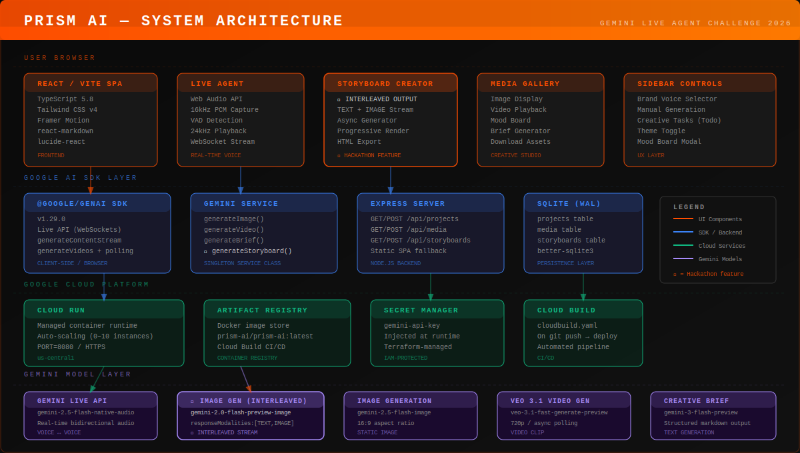

<div align="center">


# Prism AI — Creative Director
### Gemini Live Agent Challenge 2026 · Creative Storyteller Category

[](https://cloud.run)
[](https://ai.google.dev)

**A real-time multimodal creative partner that brainstorms, visualizes, and generates campaign storyboards using Gemini Live API, interleaved text+image streaming, and Veo 3.1.**

[Live Demo (AI Studio)](https://ai.studio/apps/5f4b8491-4190-428f-a4cb-d9c60dc19eaa) · [Architecture Diagram](docs/architecture.svg)

</div>

---

## What is Prism AI?

Prism AI is an AI-powered **Creative Director** — a real-time, multimodal assistant that helps marketing and creative teams go from raw idea to polished campaign assets in one fluid session. Users speak their vision aloud; Prism listens, responds with synthesized audio, generates images and video, and produces interleaved storyboards where text narration and visual frames arrive together in a single streaming response.

### Hackathon Category: Creative Storyteller ✍️

| Requirement | Implementation |
|---|---|
| **Gemini interleaved/mixed output** | `StoryboardCreator` uses `gemini-2.0-flash-preview-image-generation` with `responseModalities: [TEXT, IMAGE]` — one streaming call yields alternating narration + images |
| **Multimodal storytelling** | Voice → text briefs → generated images → video → downloadable HTML storyboard |
| **Hosted on Google Cloud** | Cloud Run + Terraform IaC + automated Cloud Build pipeline |
| **Google GenAI SDK** | `@google/genai` v1.29 for all model interactions including streaming |

---

## Features

### Live Voice Agent
Talk naturally to Prism. Streams 16kHz PCM audio to **Gemini 2.5 Flash Native Audio**, receives 24kHz audio responses with gapless Web Audio scheduling. Custom VAD detects speech pauses.

### ★ Storyboard Creator (Interleaved Output)
The core hackathon feature. One campaign concept prompt triggers a single Gemini streaming call that returns **alternating text narration and inline generated images** — no separate requests, no post-processing. Renders progressively as content streams in, with one-click HTML export.

```
Prompt → [TEXT scene 01] → [IMAGE scene 01] → [TEXT scene 02] → [IMAGE scene 02] → [TEXT direction]
```

### Image, Video & Creative Brief Generation
- **Images** — `gemini-2.5-flash-image`, 16:9, brand-voice-injected
- **Video** — `veo-3.1-fast-generate-preview`, 720p, async polling
- **Briefs** — `gemini-3-flash-preview`, structured markdown (Campaign Name / Audience / Message / Style / Tone)

### Creative Studio
Media gallery, mood board, brand voice selector (5 presets), creative task manager, dark/light theme.

---

## Architecture



```
Browser (React SPA)
  ├── LiveAgent         → Gemini Live API (WebSocket, real-time voice)
  ├── StoryboardCreator → generateContentStream (interleaved TEXT+IMAGE)
  ├── MediaGallery      → display / download / brief per asset
  └── Sidebar Controls  → brand voice, manual generation, todos

Node.js Backend (Express + SQLite WAL)
  ├── /api/projects, /api/media, /api/storyboards
  └── Static SPA fallback

Google Cloud
  ├── Cloud Run     — container hosting, auto-scale 0→10
  ├── Artifact Reg  — Docker images
  ├── Secret Mgr    — GEMINI_API_KEY
  └── Cloud Build   — CI/CD on git push (cloudbuild.yaml)
```

---

## Local Development

### Prerequisites
- Node.js 20+
- [Gemini API key](https://aistudio.google.com/app/apikey)

### Quickstart

```bash
# 1. Clone
git clone https://github.com/YOUR_USERNAME/Prism-AI.git
cd Prism-AI

# 2. Install
npm install

# 3. Set API key
cp .env.example .env
# Edit .env → GEMINI_API_KEY=your_key_here

# 4. Start dev server (frontend hot-reload)
npm run dev
# → http://localhost:3000
```

> **Video generation** (Veo 3.1) requires a paid-tier Gemini API key. Live API and image generation work with the free tier.

### Run with the persistence backend

```bash
# Build the frontend first
npm run build

# Start the Express server (serves frontend + REST API + SQLite)
npm start
# → http://localhost:8080
```

---

## Google Cloud Deployment

### Option A — One-command shell script

```bash
chmod +x infra/deploy.sh
GEMINI_API_KEY="sk-..." ./infra/deploy.sh YOUR_GCP_PROJECT_ID us-central1
```

This script:
1. Enables Cloud Run, Artifact Registry, Secret Manager, Cloud Build APIs
2. Creates an Artifact Registry Docker repository
3. Builds and pushes the Docker image
4. Stores your API key in Secret Manager
5. Deploys to Cloud Run with the secret injected at runtime
6. Prints the live HTTPS URL

### Option B — Terraform (IaC, bonus requirement)

```bash
cd infra
terraform init
terraform plan  -var="project_id=YOUR_PROJECT" -var="gemini_api_key=YOUR_KEY"
terraform apply -var="project_id=YOUR_PROJECT" -var="gemini_api_key=YOUR_KEY"
```

Provisions: Artifact Registry repository, Secret Manager secret, Cloud Run service with dedicated service account, IAM bindings, public invoker policy.

### Option C — Cloud Build CI/CD

```bash
gcloud builds triggers create github \
  --repo-name="Prism-AI" \
  --repo-owner="YOUR_USERNAME" \
  --branch-pattern="^main$" \
  --build-config="cloudbuild.yaml" \
  --project="YOUR_PROJECT_ID"
```

Every push to `main` → build → push → deploy automatically.

### Option D — Docker

```bash
docker build -t prism-ai .
docker run -p 8080:8080 -e GEMINI_API_KEY=your_key prism-ai
# → http://localhost:8080
```

---

## Project Structure

```
Prism-AI/
├── src/
│   ├── App.tsx                      # Root: state, layout, modals
│   ├── components/
│   │   ├── LiveAgent.tsx            # Real-time voice interface
│   │   ├── StoryboardCreator.tsx    # ★ Interleaved text+image streaming
│   │   ├── MediaGallery.tsx         # Asset gallery with skeleton loader
│   │   ├── ArchitectureDiagram.tsx  # In-app architecture display
│   │   └── TodoList.tsx             # Creative task manager
│   └── services/
│       └── gemini.ts                # GeminiService singleton
├── server/
│   ├── index.ts                     # Express REST API
│   └── db.ts                        # SQLite schema (WAL mode)
├── infra/
│   ├── deploy.sh                    # Shell deployment script
│   └── main.tf                      # Terraform Cloud Run + GCP stack
├── docs/
│   └── architecture.svg             # System architecture diagram
├── Dockerfile                       # Multi-stage (builder → runtime)
├── cloudbuild.yaml                  # Cloud Build CI/CD pipeline
└── .env.example                     # Environment template
```

---

## Technologies

| Layer | Technology |
|---|---|
| Frontend | React 19, TypeScript 5.8, Vite 6, Tailwind CSS v4 |
| Animations | Framer Motion (motion) 12 |
| AI SDK | @google/genai 1.29 |
| Backend | Node.js 20, Express 4, better-sqlite3 12 |
| Infrastructure | Google Cloud Run, Artifact Registry, Secret Manager |
| IaC | Terraform (hashicorp/google ~5.0), Cloud Build YAML |
| Container | Docker multi-stage (node:20-alpine) |

---

## Bonus Items

- [x] **IaC automation** — `infra/deploy.sh` (shell) + `infra/main.tf` (Terraform) in public repo
- [x] **Architecture diagram** — `docs/architecture.svg`
- [ ] Blog post with `#GeminiLiveAgentChallenge`

---

## Findings & Learnings

**Interleaved output is the future of creative tools.** Using `responseModalities: [TEXT, IMAGE]` in a single streaming call eliminates the clunky "generate text, then separately generate image" pattern. Content feels like a director thinking and sketching simultaneously — the UX is completely different.

**WebSocket audio requires a lookahead scheduler.** The 24kHz PCM output from Gemini Live needs a `nextStartTimeRef` buffer to queue audio chunks without gaps. Naive sequential `play()` calls cause audible stuttering every few seconds.

**VAD via RMS energy works well enough.** A simple threshold (RMS > 0.01) with a 1.5s silence timer accurately detects end-of-utterance without a dedicated speech detection model.

**SQLite WAL is perfect for Cloud Run.** WAL journal mode on a single-instance Cloud Run service eliminates the need for a managed database at hackathon scale. Concurrent reads are fast and write latency is under 1ms for typical payloads.

---

<div align="center">
<sub>Built for the <strong>Gemini Live Agent Challenge 2026</strong> · Powered by Google Gemini & Google Cloud</sub>
</div>
